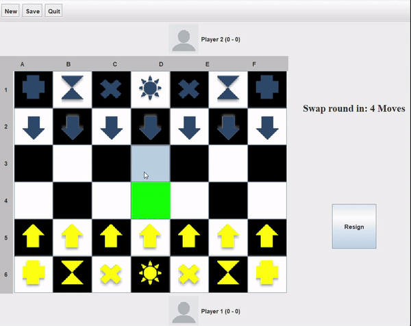

# Talabia Game Project - TCP2201

## Project Information
- **Project Name**: Talabia Game
- **Module**: TCP2201 (Trimester 2310)

---

## Table of Contents
1. [Introduction](#introduction)
2. [Installation and Setup](#installation-and-setup)
3. [UML Class Diagrams](#uml-class-diagrams)
4. [Use Case Diagrams](#use-case-diagrams)
5. [Sequence Diagrams](#sequence-diagrams)
6. [Game Instructions](#game-instructions)
7. [License](#license)

---

## Introduction

Talabia is a strategic board game developed as part of the TCP2201 module. It features a dynamic board game experience where players take turns to move pieces, capture opponents' pieces, and achieve various objectives to win the game.

---

## Installation and Setup

### Prerequisites:
- Java Development Kit (JDK) installed
- A text editor or an IDE that supports Java (e.g., IntelliJ IDEA, Eclipse)
- Command Line Interface (CLI) access

### Steps:
1. **Navigate to the correct directory**:  
   Ensure you are in the directory where your Java files are located. Use the `cd` command to change directories.

2. **Compile the Java files**:  
   Open the Command Prompt (CMD) or terminal and compile all the Java files in the directory using the following command:
   ```bash
   javac *.java
   ```
    This will compile all `.java` files and generate `.class` bytecode files.

3. **Run the program**:
    After successful compilation, run the main class `Talabia.java` using the following command:
    
    ```bash
    java Talabia
    ```
## UML Class Diagrams

- **Model**: Represents the core logic and data of the game, including classes for different strategies and patterns such as Singleton and Template Method.
- **View**: Manages the user interface elements of the game, such as displaying the game board and user interactions.
- **Controller**: Contains the game logic for controlling player actions, updating game states, and responding to player inputs.

You can view the UML class diagrams using the following links:

- [Model Diagram](https://app.diagrams.net/?page-id=ME9IjcjfFuZkWGZd5N8R)
- [View Diagram](https://app.diagrams.net/?page-id=OLVy24eoel8JksQwI-H4)
- [Controller Diagram](https://app.diagrams.net/?page-id=BOF1RafWjJp0yVhQ4V5G)

## Use Case Diagrams

The use case diagram outlines the interaction between the player and the game system. Players can start a new game, load a previously saved game, and exit the application.

## Sequence Diagrams

These diagrams show the flow of various interactions in the game, including:

- **Switch Turns**: Alternating between Player 1 and Player 2.
- **Set Winner**: Handling the win condition when a player meets the game's winning criteria.
- **Swap Pieces**: Changing the positions of pieces on the board under specific game conditions.
- **Game Over**: Handling the end of a game when a winner is determined or a player resigns.

## Game Instructions

### Main Menu

The main menu includes the following options:

- **Start Game**: Begin a new game.
- **Load Game**: Load a previously saved game.
- **Exit Game**: Exit the application.

## Talabia Mainframe

Once the game starts, the interface consists of the following components:

**Talabia Board**: The game board where pieces are moved and battles take place.
- **Buttons**:
  - **New**: Start a new game by resetting the game board and elements.
  - **Save**: Save the current game state, including the positions of pieces and player scores.
  - **Quit**: Exit the game without saving.
  - **Resign**: A player can resign, declaring the opponent as the winner.
- **Player Section**: Displays information about the players including:
  - **Name**: The player’s name.
  - **Photo**: The player’s chosen avatar.
  - **Score**: The current score, updated based on game events such as a captured sun or a resignation.

    Pieces Movement:
    Player 1 (yellow pieces) begins the game. Valid moves are indicated by green squares, while capturing opportunities are highlighted by red squares.
    Game Turns:
    After Player 1's turn, the board flips for Player 2 (blue pieces) to make their move. Certain pieces such as "Time" and "Plus" swap positions after a set number of moves.
    
### Talabia Buttons
- **New Button**:  
  Clicking "New" will display a confirmation prompt. Upon confirmation, a new game starts, resetting all elements.
  - **Save Button**:  
  Clicking "Save" saves the game’s current state. A confirmation window ensures the player’s intent to save.
- **Quit Button**:  
  Clicking "Quit" immediately exits the game without saving.
  - **Resign Button**:  
  Clicking "Resign" prompts the player to confirm the decision to resign. If confirmed, the opposing player is declared the winner.

## Talabia Game Interface

   

This is a screenshot of the Talabia Chess Game showing the main interface, including the game board and player information.

## License

This project is part of academic coursework and is not intended for commercial use.


